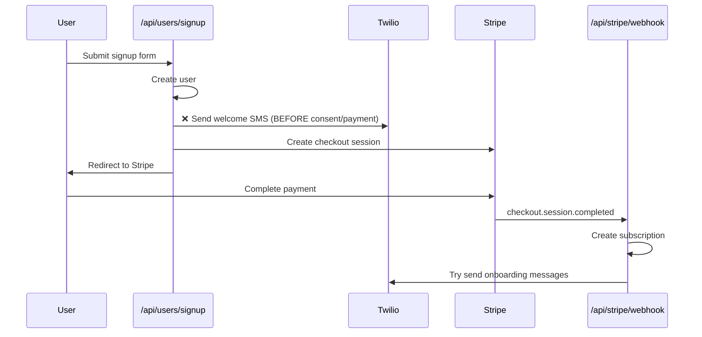
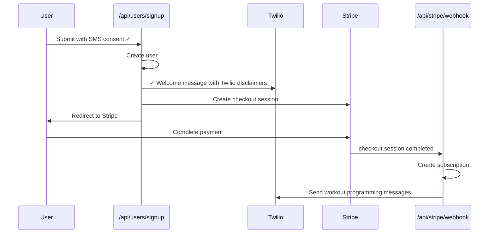

# RFC: Twilio 10DLC Compliance Implementation

**Status:** Draft  
**Author:** Benji (Staff Engineer Agent)  
**Date:** February 19, 2026  
**Related PRD:** [TWILIO-COMPLIANCE-PRD.md](./TWILIO-COMPLIANCE-PRD.md)  
**Branch:** `twilio-compliance-welcome-message`

---

## Executive Summary

This RFC outlines the implementation approach for Twilio 10DLC compliance requirements. The changes ensure GymText meets all Twilio campaign approval criteria while improving the user signup experience.

**Key Changes:**
1. Remove pre-checkout welcome message (current compliance violation)
2. Add one Twilio-compliant welcome message immediately after signup
3. Add separate SMS consent checkbox with full disclosures
4. Create public `/opt-in` page for campaign submission
5. Update privacy policy with required mobile data statement

**Implementation Phases:** 5 phases, estimated 6-8 hours total work

---

## Table of Contents

1. [Current State Analysis](#current-state-analysis)
2. [Implementation Strategy](#implementation-strategy)
3. [Detailed Implementation Plan](#detailed-implementation-plan)
4. [File Changes Summary](#file-changes-summary)
5. [Testing Strategy](#testing-strategy)
6. [Risks & Mitigation](#risks--mitigation)
7. [Rollout Plan](#rollout-plan)
8. [Open Questions](#open-questions)

---

## Current State Analysis

### Current Message Flow (COMPLIANCE VIOLATION)



**Problems:**
- ✗ Welcome message sent BEFORE explicit SMS consent checkbox
- ✗ No separate SMS consent checkbox (hardcoded to `true`)
- ✗ Missing required Twilio disclaimers in message
- ✗ No public opt-in page for campaign submission

### Target Message Flow (TWILIO COMPLIANT)



**Benefits:**
- ✓ Message sent AFTER explicit SMS consent
- ✓ Separate SMS consent checkbox with full Twilio disclosures
- ✓ Compliant welcome message with required elements
- ✓ Clear separation: welcome message → checkout → programming messages

---

## Implementation Strategy

### Guiding Principles

1. **Compliance First:** All changes must meet Twilio 10DLC requirements
2. **Minimal Disruption:** Leverage existing infrastructure (message orchestrator, Inngest)
3. **Backward Compatible:** Don't break existing user flows
4. **Testable:** Each phase can be tested independently
5. **Aaron's Guidance:** Use message orchestrator queue message (the normal way we send messages)

### Phase-Based Approach

**Why phased?**
- Each phase is independently testable
- Can deploy critical fixes (Phase 1-2) before UX improvements (Phase 3-4)
- Easier code review and QA
- Reduces risk of breaking existing flows

**Phase Order Rationale:**
1. **Phase 1-2** (Critical): Fix the compliance violation immediately
2. **Phase 5** (Prerequisite): Privacy policy needed before opt-in form can link to it
3. **Phase 3** (Required): Add consent checkbox to signup form
4. **Phase 4** (Required): Create public opt-in page for Twilio submission

---

## Detailed Implementation Plan

### Phase 1: Replace Pre-Checkout Welcome Message

**Priority:** CRITICAL (Twilio Compliance Requirement)

**File:** `apps/web/src/app/api/users/signup/route.ts`

**Current Code (Lines ~218-223):**
```typescript
// Send welcome SMS
console.log('[Signup] Sending welcome SMS');
const userWithProfile = await services.user.getUser(userId);
if (userWithProfile) {
  const welcomeMessage = await services.messagingAgent.generateWelcomeMessage(userWithProfile);
  await services.messagingOrchestrator.sendImmediate(userWithProfile, welcomeMessage);
}
```

**New Code:**
```typescript
// Send Twilio-compliant welcome message immediately after signup
console.log('[Signup] Sending welcome message');
const userWithProfile = await services.user.getUser(userId);
if (userWithProfile && userWithProfile.smsConsent) {
  try {
    // Queue single welcome message with Twilio-required disclosures
    await services.messagingOrchestrator.queueMessages(
      userWithProfile,
      [
        {
          content:
            "Welcome to GymText! Ready to transform your fitness? We'll be texting you daily workouts starting soon. Msg & data rates may apply. Reply STOP to opt out.",
        },
      ],
      'onboarding'
    );
    console.log('[Signup] Sent welcome message');
  } catch (error) {
    console.error('[Signup] Failed to send welcome message:', error);
    // Don't block signup if message sending fails
  }
}
```

**Key Changes:**
- Replace AI-generated welcome message with static Twilio-compliant text
- Send ONE message with all required Twilio disclaimers
- Add SMS consent check (`userWithProfile.smsConsent`) - critical for Phase 3
- Use message orchestrator queue (Aaron's guidance)
- Wrap in try-catch to prevent blocking signup on message failures

**Why Static Message?**
- Twilio requires specific wording: "Msg & data rates may apply", "Reply STOP to opt out"
- AI-generated messages might vary and miss required elements
- Campaign approval requires consistent message samples
- Compliance first, can enhance later

**Testing:**
- Verify message sends with correct content
- Verify message only sends when `smsConsent` is true
- Check message content matches Twilio requirements exactly
- Test with existing users (should still work with hardcoded consent)
- Verify signup succeeds even if message sending fails

---

### Phase 2: Send Programming Messages After Payment

**Priority:** CRITICAL (Completes message flow)

**File:** `apps/web/src/app/api/stripe/webhook/route.ts`

**Current Code (Lines ~77-88):**
```typescript
// Create subscription record
await repos.subscription.create({
  clientId: userId,
  stripeSubscriptionId: subscription.id,
  status: subscription.status,
  planType: 'monthly',
  currentPeriodStart: new Date(subscription.current_period_start * 1000),
  currentPeriodEnd: new Date(subscription.current_period_end * 1000),
});

console.log(`[Stripe Webhook] Subscription created for user ${userId}`);
```

**Change:** The actual onboarding messages are already handled later in the webhook (lines 105-115):
```typescript
// Try to send onboarding messages (if onboarding is complete)
try {
  const sent = await services.onboardingCoordinator.sendOnboardingMessages(userId);
  if (sent) {
    console.log(`[Stripe Webhook] Onboarding messages sent to user ${userId}`);
  } else {
    console.log(`[Stripe Webhook] Waiting for onboarding to complete for user ${userId}`);
  }
} catch (error) {
  // Don't fail the webhook if message sending fails
  console.error(`[Stripe Webhook] Failed to send messages for user ${userId}:`, error);
}
```

**Analysis:** NO CODE CHANGES NEEDED

The webhook already:
- Creates subscription after payment
- Sends onboarding/programming messages via `onboardingCoordinator.sendOnboardingMessages()`
- Handles failures gracefully (doesn't block webhook)

**What happens now:**
1. User gets welcome message BEFORE checkout (Phase 1)
2. User completes payment via Stripe
3. Webhook fires and sends actual workout programming messages

**Perfect separation:**
- Welcome message = before payment (Phase 1)
- Programming messages = after payment (existing code)

**Testing:**
- Verify onboarding messages still send after checkout
- Confirm no duplicate messages
- Test that webhook doesn't fail if message sending fails

---

### Phase 3: Add SMS Consent Checkbox

**Priority:** REQUIRED (Twilio Compliance)

This phase adds the separate SMS consent checkbox with full Twilio disclosures.

#### 3.1 Update TypeScript Types

**File:** `apps/web/src/lib/questionnaire/types.ts`

**Change Line 7:**
```typescript
// OLD
export type QuestionType = 'select' | 'multiselect' | 'text' | 'phone' | 'boolean';

// NEW
export type QuestionType = 'select' | 'multiselect' | 'text' | 'phone' | 'boolean' | 'consent';
```

**Add to QuestionnaireQuestion interface (after line 35):**
```typescript
  /** Additional metadata for specific question types */
  metadata?: {
    /** For consent questions: full consent text with links */
    consentText?: string;
    /** For consent questions: checkbox label */
    checkboxLabel?: string;
    /** For consent questions: whether checkbox starts selected */
    preSelected?: boolean;
  };
```

#### 3.2 Create ConsentQuestion Component

**File:** `apps/web/src/components/questionnaire/questions/ConsentQuestion.tsx` (NEW)

```tsx
'use client';

import { useState } from 'react';
import { QuestionCard } from '../QuestionCard';
import { ContinueButton } from '../ContinueButton';
import type { QuestionnaireQuestion } from '@/lib/questionnaire/types';

interface ConsentQuestionProps {
  question: QuestionnaireQuestion;
  value?: boolean;
  onChange: (value: boolean) => void;
  onNext: () => void;
}

export function ConsentQuestion({ question, value, onChange, onNext }: ConsentQuestionProps) {
  const [error, setError] = useState<string | null>(null);
  const isChecked = value === true;

  const handleCheckboxChange = (checked: boolean) => {
    onChange(checked);
    setError(null);
  };

  const handleContinue = () => {
    if (!isChecked && question.required) {
      setError('You must consent to receive text messages to use GymText');
      return;
    }
    onNext();
  };

  return (
    <QuestionCard title={question.questionText}>
      <div className="space-y-6">
        {/* Consent text with links */}
        {question.metadata?.consentText && (
          <div
            className="text-sm text-[hsl(var(--questionnaire-muted-foreground))] leading-relaxed"
            dangerouslySetInnerHTML={{ __html: question.metadata.consentText }}
          />
        )}

        {/* Checkbox */}
        <label className="flex items-start gap-3 cursor-pointer group">
          <input
            type="checkbox"
            checked={isChecked}
            onChange={(e) => handleCheckboxChange(e.target.checked)}
            className="mt-1 h-5 w-5 rounded border-2 border-[hsl(var(--questionnaire-muted))] 
                     checked:bg-[hsl(var(--questionnaire-accent))] 
                     checked:border-[hsl(var(--questionnaire-accent))]
                     focus:ring-2 focus:ring-[hsl(var(--questionnaire-accent))] focus:ring-offset-2
                     transition-colors cursor-pointer"
          />
          <span className="text-[hsl(var(--questionnaire-foreground))] font-medium select-none">
            {question.metadata?.checkboxLabel || 'I consent'}
          </span>
        </label>

        {/* Error message */}
        {error && (
          <div className="text-sm text-red-500 font-medium">
            {error}
          </div>
        )}

        {/* Continue button */}
        <ContinueButton
          onClick={handleContinue}
          disabled={!isChecked && question.required}
        />
      </div>
    </QuestionCard>
  );
}
```

**Design Notes:**
- Uses `dangerouslySetInnerHTML` to render links in consent text (safe for our controlled content)
- Checkbox NOT pre-selected (Twilio requirement)
- Validation on "Continue" click (required field check)
- Error state for missing consent
- Disabled continue button when required consent not given
- Uses existing QuestionCard and ContinueButton components

#### 3.3 Add Consent Question to Base Questions

**File:** `apps/web/src/lib/questionnaire/baseQuestions.ts`

**Add after phone question in both `baseQuestions` and `programBaseQuestions` arrays:**

```typescript
{
  id: 'smsConsent',
  questionText: 'SMS Messaging Consent',
  type: 'consent',
  required: true,
  source: 'base',
  metadata: {
    consentText: `By checking this box, I agree to receive recurring automated fitness and workout text messages from GymText at the mobile number provided. You will receive daily workout messages. Message frequency may vary. Message and data rates may apply. Reply HELP for help or STOP to cancel. View our <a href="/terms" target="_blank" class="text-blue-600 hover:underline">Terms of Service</a> and <a href="/privacy" target="_blank" class="text-blue-600 hover:underline">Privacy Policy</a>. Your mobile information will not be shared with third parties.`,
    checkboxLabel: 'I consent to receive text messages from GymText',
    preSelected: false,
  },
},
```

**Placement:** After `phone` question (insert at end of array)

**Rationale:**
- User enters phone number first, then immediately consents to SMS
- Follows natural flow: "What's your phone?" → "Can we text you?"
- All required Twilio disclosures present in consent text

#### 3.4 Update Questionnaire Component

**File:** `apps/web/src/components/questionnaire/Questionnaire.tsx`

**Add import (top of file):**
```typescript
import { ConsentQuestion } from './questions/ConsentQuestion';
```

**Add case to renderQuestion() function (around line 150):**
```typescript
case 'consent':
  return (
    <ConsentQuestion
      question={currentQuestion}
      value={currentValue as boolean | undefined}
      onChange={(v) => setAnswer(v)}
      onNext={handleNext}
    />
  );
```

**Update handleSubmit() function (lines 82-86):**
```typescript
// OLD
smsConsent: true,
smsConsentedAt: new Date().toISOString(),

// NEW
smsConsent: answers.smsConsent as boolean,
smsConsentedAt: answers.smsConsent ? new Date().toISOString() : undefined,
```

**Testing:**
- Verify consent question renders with checkbox unchecked
- Verify links to /terms and /privacy work (open in new tab)
- Verify validation error shows when trying to continue without checking
- Verify submitted data includes `smsConsent: true` when checked
- Verify submitted data includes `smsConsentedAt` timestamp
- Verify submitted data has `smsConsent: false` if unchecked (shouldn't be possible with required field)

---

### Phase 4: Create Public Opt-in Page

**Priority:** REQUIRED (Twilio Campaign Submission)

**File:** `apps/web/src/app/opt-in/page.tsx` (NEW)

Create a complete static page for Twilio campaign reviewers. See PRD Section "Opt-in Page Requirements" for full content.

**Implementation:**
```tsx
import { Metadata } from 'next';

export const metadata: Metadata = {
  title: 'SMS Messaging Program - GymText',
  description: 'Information about GymText SMS messaging program and opt-in process',
};

export default function OptInPage() {
  return (
    <div className="min-h-screen bg-gray-50 py-12 px-4 sm:px-6 lg:px-8">
      <div className="max-w-3xl mx-auto bg-white rounded-lg shadow-lg p-8 space-y-8">
        {/* Header */}
        <div className="text-center border-b pb-6">
          <h1 className="text-3xl font-bold text-gray-900">
            GymText SMS Messaging Program
          </h1>
          <p className="mt-2 text-gray-600">
            Automated daily workout messages delivered to your phone
          </p>
        </div>

        {/* How to Opt In */}
        <section>
          <h2 className="text-2xl font-semibold text-gray-900 mb-4">
            How to Opt In
          </h2>
          <p className="text-gray-700 mb-4">
            To receive workout messages from GymText, you must:
          </p>
          <ol className="list-decimal list-inside space-y-2 text-gray-700 ml-4">
            <li>Visit <a href="https://gymtext.com/start" className="text-blue-600 hover:underline">gymtext.com/start</a></li>
            <li>Complete the signup questionnaire</li>
            <li>Provide your mobile phone number</li>
            <li>Check the box to consent to receiving text messages</li>
            <li>Complete payment through Stripe checkout</li>
          </ol>
          <p className="text-gray-700 mt-4">
            After successful payment, you will receive a confirmation message and begin receiving daily workout messages.
          </p>
        </section>

        {/* Program Details */}
        <section className="border-t pt-6">
          <h2 className="text-2xl font-semibold text-gray-900 mb-4">
            Program Information
          </h2>
          <dl className="space-y-3">
            <div>
              <dt className="font-semibold text-gray-900">Program Name:</dt>
              <dd className="text-gray-700 ml-4">GymText</dd>
            </div>
            <div>
              <dt className="font-semibold text-gray-900">Message Type:</dt>
              <dd className="text-gray-700 ml-4">Recurring automated workout and fitness messages</dd>
            </div>
            <div>
              <dt className="font-semibold text-gray-900">Message Frequency:</dt>
              <dd className="text-gray-700 ml-4">
                Daily (approximately 30 messages per month). Frequency may vary based on your program.
              </dd>
            </div>
            <div>
              <dt className="font-semibold text-gray-900">Cost:</dt>
              <dd className="text-gray-700 ml-4">
                Standard message and data rates may apply based on your mobile carrier plan. 
                GymText does not charge for text messages beyond your subscription fee.
              </dd>
            </div>
          </dl>
        </section>

        {/* Required Disclosures */}
        <section className="border-t pt-6">
          <h2 className="text-2xl font-semibold text-gray-900 mb-4">
            Important Information
          </h2>
          <div className="bg-blue-50 border border-blue-200 rounded-lg p-6 space-y-2 text-gray-800">
            <p>By opting in to GymText's messaging program, you agree to the following:</p>
            <ul className="list-disc list-inside space-y-2 ml-4">
              <li>You will receive recurring automated text messages from GymText</li>
              <li>Message and data rates may apply</li>
              <li>Your mobile information will not be shared with third parties or affiliates for marketing purposes</li>
              <li>You can opt out at any time by texting STOP to any GymText message</li>
              <li>You can get help by texting HELP to any GymText message</li>
              <li>For full terms, visit <a href="/terms" className="text-blue-600 hover:underline">gymtext.com/terms</a></li>
              <li>For our privacy policy, visit <a href="/privacy" className="text-blue-600 hover:underline">gymtext.com/privacy</a></li>
            </ul>
          </div>
        </section>

        {/* Support */}
        <section className="border-t pt-6">
          <h2 className="text-2xl font-semibold text-gray-900 mb-4">
            Support
          </h2>
          <p className="text-gray-700 mb-3">For help with GymText:</p>
          <ul className="list-disc list-inside space-y-2 text-gray-700 ml-4">
            <li>Text HELP to any GymText message</li>
            <li>Email: <a href="mailto:support@gymtext.com" className="text-blue-600 hover:underline">support@gymtext.com</a></li>
            <li>Visit: <a href="/help" className="text-blue-600 hover:underline">gymtext.com/help</a></li>
          </ul>
        </section>

        {/* Opt Out */}
        <section className="border-t pt-6">
          <h2 className="text-2xl font-semibold text-gray-900 mb-4">
            How to Opt Out
          </h2>
          <p className="text-gray-700 mb-3">
            You can stop receiving messages at any time by:
          </p>
          <ul className="list-disc list-inside space-y-2 text-gray-700 ml-4">
            <li>Texting STOP to any message from GymText</li>
            <li>Canceling your subscription at <a href="/account" className="text-blue-600 hover:underline">gymtext.com/account</a></li>
          </ul>
          <p className="text-gray-700 mt-4">
            You will receive a confirmation message that you have been unsubscribed. 
            You will not receive further messages unless you opt in again.
          </p>
        </section>

        {/* Footer */}
        <div className="border-t pt-6 text-center text-sm text-gray-500">
          <p>Last updated: February 19, 2026</p>
        </div>
      </div>
    </div>
  );
}
```

**Key Features:**
- Public page (no auth required)
- Server-rendered (SEO-friendly)
- All required Twilio disclosures present
- Clear sections for campaign reviewers
- Links to Terms and Privacy
- Professional, clean design

**Testing:**
- Verify page accessible at `https://gymtext.com/opt-in`
- Verify all links work (terms, privacy, help, etc.)
- Verify page renders correctly on mobile
- Take screenshot for Twilio campaign submission

---

### Phase 5: Update Privacy Policy

**Priority:** REQUIRED (Prerequisite for Phase 3)

**File:** Check if `apps/web/src/app/privacy/page.tsx` exists (NEED TO VERIFY)

**Required Addition:**

Add new section or update existing "How We Use Your Information" section:

```markdown
### Mobile Information and SMS Messaging

When you provide your mobile phone number and opt in to receive text messages:

- We collect and store your mobile phone number to deliver workout messages
- **Your mobile information will not be shared with third parties or affiliates for marketing purposes**
- We use Twilio as our messaging service provider to deliver SMS messages
- You can opt out of messages at any time by texting STOP
- Standard message and data rates from your carrier may apply

We maintain your mobile information solely for the purpose of delivering your GymText workout program.
```

**Critical Element:** The bolded statement is REQUIRED by Twilio for web-based opt-in.

**Testing:**
- Verify privacy policy accessible at `/privacy`
- Verify mobile data non-sharing statement is visible
- Verify statement matches Twilio requirements exactly

---

## File Changes Summary

### Files to Modify

| File | Phase | Changes | Lines |
|------|-------|---------|-------|
| `apps/web/src/app/api/users/signup/route.ts` | 1 | Replace welcome message with one compliant message | ~10 |
| `apps/web/src/lib/questionnaire/types.ts` | 3.1 | Add 'consent' type, add metadata interface | ~5 |
| `apps/web/src/lib/questionnaire/baseQuestions.ts` | 3.3 | Add smsConsent question to both arrays | ~20 |
| `apps/web/src/components/questionnaire/Questionnaire.tsx` | 3.4 | Add consent case, update submission logic | ~15 |
| `apps/web/src/app/privacy/page.tsx` | 5 | Add mobile data non-sharing statement | ~10 |

### Files to Create

| File | Phase | Purpose | Lines |
|------|-------|---------|-------|
| `apps/web/src/components/questionnaire/questions/ConsentQuestion.tsx` | 3.2 | New consent checkbox component | ~80 |
| `apps/web/src/app/opt-in/page.tsx` | 4 | Public opt-in page for Twilio | ~150 |

### Total Changes

- **Files Modified:** 5
- **Files Created:** 2
- **Estimated LOC:** ~290 lines total

---

## Testing Strategy

### Unit Tests (Optional for MVP)

Given timeline constraints, focus on manual testing. Unit tests can be added later:

- `ConsentQuestion.tsx`: Checkbox behavior, validation
- Signup route: Message sending logic
- Questionnaire: Answer submission with consent

### Integration Tests (Required)

**Test Scenarios:**

1. **New User Signup (Happy Path)**
   - Fill out questionnaire
   - Check SMS consent checkbox
   - Submit form
   - Verify ONE welcome message received
   - Complete Stripe checkout
   - Verify programming messages received after payment

2. **Signup Without SMS Consent (Edge Case)**
   - Try to submit without checking SMS consent
   - Verify validation error shows
   - Cannot proceed until checked

3. **Existing User Re-signup**
   - Existing user signs up again
   - Verify consent checkbox behavior
   - Verify messages still send correctly

4. **Message Content Validation**
   - Verify message includes: brand name, "Msg & data rates may apply", "Reply STOP to opt out"
   - Verify message mentions daily workouts starting soon
   - Verify no AI-generated variations

5. **Webhook Flow**
   - Trigger test webhook with Stripe CLI
   - Verify programming messages send
   - Verify no duplicate welcome messages

### Manual QA Checklist

- [ ] Consent checkbox appears on signup form
- [ ] Consent checkbox NOT pre-selected
- [ ] Links to Terms and Privacy work
- [ ] Validation prevents submission without consent
- [ ] One welcome message sends after signup (before checkout)
- [ ] Message has correct Twilio-required wording
- [ ] Programming messages send after Stripe webhook
- [ ] `/opt-in` page is publicly accessible
- [ ] Privacy policy includes mobile data statement
- [ ] Test on mobile device (real SMS)

### Test Data Requirements

- Test phone numbers (Twilio test credentials)
- Test Stripe card: `4242 4242 4242 4242`
- Multiple test users with different consent states

---

## Risks & Mitigation

### Risk 1: Message Sending Failures

**Risk:** Message queue call fails, blocking signup

**Impact:** User doesn't get welcome message, signup might fail

**Mitigation:**
- Wrap message sending in try-catch (don't block signup)
- Log failures for monitoring
- Signup succeeds even if message fails
- Already using message queue (more reliable than immediate send)

**Code Pattern:**
```typescript
try {
  await services.messagingOrchestrator.queueMessages(userWithProfile, [...], 'onboarding');
  console.log('[Signup] Sent welcome message');
} catch (error) {
  console.error('[Signup] Failed to send welcome message:', error);
  // Don't throw - allow signup to continue
}
```

### Risk 2: Race Condition - Webhook Before Onboarding

**Risk:** Stripe webhook fires before Inngest onboarding job completes

**Impact:** Programming messages might not send (no workout plan yet)

**Mitigation:**
- Existing code already handles this (line 111: "Waiting for onboarding to complete")
- `onboardingCoordinator.sendOnboardingMessages()` returns false if not ready
- No code changes needed, just verify behavior

**Testing:** Trigger webhook immediately after signup (before Inngest job runs)

### Risk 3: Privacy Policy Location Unknown

**Risk:** Don't know where privacy policy lives, might not exist

**Impact:** Can't add required mobile data statement

**Mitigation:**
- CHECK: Find privacy policy in codebase
- If missing: Create new privacy page
- Aaron can review/approve privacy wording

**Action:** OPEN QUESTION - need to verify privacy page location

### Risk 4: Twilio Campaign Still Rejected

**Risk:** Implement everything but Twilio still rejects campaign

**Impact:** Wasted implementation effort

**Mitigation:**
- PRD based on official Twilio documentation
- Implementation follows exact requirements
- Can iterate based on rejection feedback
- Aaron can submit campaign for review before full rollout

**Recommendation:** Submit campaign ASAP after Phase 1-3 complete

---

## Rollout Plan

### Pre-Deployment

1. **Code Review** (Aaron)
   - Review RFC (this document)
   - Review implementation PRs
   - Approve message wording

2. **QA Testing** (Manual)
   - Run through all test scenarios
   - Test on real phone number
   - Verify message content

3. **Privacy Policy Review** (Aaron/Legal)
   - Approve mobile data statement wording
   - Verify compliance with existing privacy policy

### Deployment Strategy

**Option A: Phased Rollout (Recommended)**
1. Deploy Phase 1-2 (message changes) to staging
2. Test end-to-end with Stripe test mode
3. Deploy Phase 3-5 (consent checkbox + pages)
4. Full QA on staging
5. Deploy to production
6. Monitor for 24 hours
7. Submit Twilio campaign

**Option B: All-at-Once**
1. Implement all phases
2. Full QA on staging
3. Deploy to production
4. Submit Twilio campaign immediately

**Recommendation:** Option A - safer, easier to debug

### Monitoring

**Metrics to Track:**
- Signup completion rate (should not decrease)
- Message delivery success rate
- Consent checkbox selection rate (should be ~100% for completed signups)
- Stripe checkout completion rate

**Alerts:**
- Message sending failures spike
- Signup errors increase
- Consent rate drops below 95%

### Rollback Plan

**If messages fail:**
- Revert to old welcome message (single AI-generated)
- Remove consent checkbox requirement
- Investigate message sending issue

**If signups drop:**
- Check if consent checkbox causing abandonment
- Review error logs
- Consider UX improvements to consent step

---

## Open Questions

### For Aaron

1. **Privacy Policy Location**
   - Where is the current privacy policy?
   - Path: `apps/web/src/app/privacy/page.tsx`?
   - Or is it a static markdown file?

2. **Terms of Service Location**
   - Where is the current terms page?
   - Path: `apps/web/src/app/terms/page.tsx`?

3. **Support Email**
   - Confirm support email is `support@gymtext.com`
   - Used in opt-in page

4. **Help Page**
   - Does `/help` page exist?
   - Linked from opt-in page
   - If not, should we create one?

5. **Message Wording Approval**
   - Approve exact wording for welcome message:
     - "Welcome to GymText! Ready to transform your fitness? We'll be texting you daily workouts starting soon. Msg & data rates may apply. Reply STOP to opt out."

6. **Timeline**
   - When do you need this deployed?
   - When are you submitting Twilio campaign?
   - Any deadline pressure?

7. **Existing Users**
   - What happens to users who signed up before consent checkbox?
   - Should we backfill consent data?
   - Or assume historical consent for existing users?

### Technical Questions

1. **Message Queueing vs Immediate**
   - PRD says "use message orchestrator queue message"
   - But current code uses `sendImmediate()`
   - Should we use `queueMessage()` instead?
   - Or is `sendImmediate()` the right approach?

2. **Environment Variables**
   - Are all Twilio credentials in place?
   - Any new env vars needed?

3. **Build Verification**
   - Should we add the new pages to turbo.json?
   - Any special build configuration needed?

---

## Next Steps

1. **Aaron Reviews RFC** ← YOU ARE HERE
   - Approve approach
   - Answer open questions
   - Approve message wording

2. **Benji Implements Phase 1**
   - Update signup route
   - Test message sending

3. **Aaron Reviews Phase 1**
   - Test on staging
   - Approve for production

4. **Benji Implements Phase 3-5**
   - Consent checkbox
   - Opt-in page
   - Privacy policy

5. **Full QA**
   - End-to-end testing
   - Real device testing

6. **Deploy to Production**
   - Monitor metrics
   - Watch for errors

7. **Submit Twilio Campaign**
   - Take screenshots
   - Fill out campaign form
   - Submit for review

---

## Conclusion

This implementation follows Twilio's exact compliance requirements while maintaining GymText's existing user flow. The phased approach allows for safe, testable deployment with minimal risk.

**Key Success Criteria:**
- ✓ One compliant welcome message sends after signup
- ✓ Separate SMS consent checkbox with full disclosures
- ✓ Public opt-in page for Twilio submission
- ✓ Privacy policy includes mobile data statement
- ✓ No disruption to existing user signups
- ✓ Twilio campaign approved

**Estimated Timeline:**
- Implementation: 6-8 hours
- Testing: 2-3 hours
- Review/Iteration: 2-3 hours
- **Total: 10-14 hours**

Ready to start implementation pending Aaron's approval and answers to open questions.

---

**Questions? Feedback? Changes needed?** Reply with your thoughts and I'll update the RFC accordingly.
