# Agent Catalog

## Quick Reference

| Agent ID | Category | Purpose |
|----------|----------|---------|
| `chat:generate` | Chat | Main chat response with tool access |
| `profile:update` | Profile | Creates/updates fitness profiles from messages |
| `profile:user` | Profile | Extracts user info (timezone, name, preferences) |
| `plan:generate` | Plan | Generates comprehensive training programs |
| `plan:modify` | Plan | Modifies plan at mesocycle level |
| `week:generate` | Week | Generates weekly microcycle workouts |
| `week:format` | Week | Formats week as markdown for dossier |
| `week:details` | Week | Generates structured week overview JSON |
| `week:modify` | Week | Modifies existing week based on feedback |
| `workout:format` | Workout | Formats daily workout as text message |
| `workout:details` | Workout | Generates structured workout JSON for UI |
| `workout:modify` | Workout | Modifies single workout based on request |
| `messaging:plan-summary` | Messaging | Generates plan SMS summaries |
| `messaging:plan-ready` | Messaging | Generates "plan ready" notifications |
| `program:parse` | Utility | Parses raw text into structured programs |
| `blog:metadata` | Utility | Extracts metadata from blog content |

## Agents by Category

### Chat

#### `chat:generate`
- **Purpose**: Main conversational agent with tool access for user interactions
- **Model**: gpt-5.2
- **Tools**: `update_profile`, `get_workout`, `modify_workout`, `modify_week`, `modify_plan`
- **Output**: Plain text
- **Prompt**: Inline
- **Invoked by**: `ChatService.handleMessage()`

### Profile

#### `profile:update`
- **Purpose**: Creates and updates fitness profiles from user messages
- **Model**: gpt-5.2 | Temp: 0.7 | Max tokens: 16k | Max iterations: 3
- **Tools**: None
- **Output**: Plain text
- **Prompt files**: `01-profile-agent.md` (system), `01-profile-agent-USER.md` (user template)
- **Invoked by**: `update_profile` tool → `ProfileService`

#### `profile:user`
- **Purpose**: Extracts timezone, name, and preferences from messages
- **Model**: gpt-5.2
- **Tools**: None
- **Output**: Plain JSON
- **Prompt**: Inline
- **Invoked by**: `ProfileService`

### Plan

#### `plan:generate`
- **Purpose**: Generates comprehensive training programs with mesocycle structure
- **Model**: gpt-5.2 | Temp: 1.0 | Max tokens: 16k | Max iterations: 5
- **Tools**: None
- **Output**: Plain text
- **Prompt files**: `02-plan-agent.md` (system), `02-plan-agent-USER.md` (user template)
- **Invoked by**: `TrainingService`

#### `plan:modify`
- **Purpose**: Modifies existing plan at mesocycle level
- **Model**: gpt-5.2
- **Tools**: None
- **Output**: Plain text
- **Prompt**: Inline
- **Invoked by**: `modify_plan` tool → `PlanModificationService`

### Week

#### `week:generate`
- **Purpose**: Generates weekly microcycle workout patterns
- **Model**: gpt-5.2 | Temp: 1.0 | Max tokens: 16k | Max iterations: 4
- **Tools**: None
- **Output**: Plain text
- **Prompt files**: `03-microcycle-agent.md` (system), `03-microcycle-agent-USER.md` (user template)
- **Invoked by**: `TrainingService`

#### `week:format`
- **Purpose**: Formats weekly training data as markdown for dossier
- **Model**: gpt-5.2
- **Tools**: None
- **Output**: Plain text
- **Prompt**: Inline
- **Invoked by**: `MarkdownService`

#### `week:details`
- **Purpose**: Generates structured week overview for UI consumption
- **Model**: gpt-5.2
- **Tools**: None
- **Output**: JSON Schema (days array)
- **Prompt**: Inline
- **Invoked by**: `TrainingService`

#### `week:modify`
- **Purpose**: Modifies existing week based on user feedback
- **Model**: gpt-5.2 | Temp: 1.0 | Max tokens: 16k | Max iterations: 3
- **Tools**: None
- **Output**: Plain text
- **Prompt files**: `05-week-modify-agent.md` (system), `05-week-modify-agent-USER.md` (user template)
- **Invoked by**: `modify_week` tool → `WorkoutModificationService`

### Workout

#### `workout:format`
- **Purpose**: Formats daily workout as SMS text message
- **Model**: gpt-5.2 | Temp: 1.0 | Max tokens: 16k | Max iterations: 2
- **Tools**: None
- **Output**: Plain text
- **Prompt files**: `04-workout-message-agent.md` (system), `04-workout-message-agent-USER.md` (user template)
- **Invoked by**: `TrainingService`

#### `workout:details`
- **Purpose**: Generates structured workout JSON with blocks and items for UI
- **Model**: gpt-5.2
- **Tools**: None
- **Output**: JSON Schema (blocks + items)
- **Prompt**: Inline
- **Invoked by**: `TrainingService`

#### `workout:modify`
- **Purpose**: Modifies a single workout based on user request
- **Model**: gpt-5.2
- **Tools**: None
- **Output**: Plain text
- **Prompt**: Inline (tool-invoked only)
- **Invoked by**: `modify_workout` tool → `WorkoutModificationService`

### Messaging

#### `messaging:plan-summary`
- **Purpose**: Generates concise plan summary for SMS delivery
- **Model**: gpt-5.2
- **Tools**: None
- **Output**: Plain text
- **Prompt**: Inline
- **Invoked by**: `MessagingAgentService`

#### `messaging:plan-ready`
- **Purpose**: Generates "your plan is ready" notification messages
- **Model**: gpt-5.2
- **Tools**: None
- **Output**: Plain text
- **Prompt**: Inline
- **Invoked by**: `MessagingAgentService`

### Utility

#### `program:parse`
- **Purpose**: Parses raw text/documents into structured fitness programs
- **Model**: gpt-5.2
- **Tools**: None
- **Output**: Plain text
- **Prompt**: Inline
- **Invoked by**: `ProgramAgentService`

#### `blog:metadata`
- **Purpose**: Extracts metadata (title, tags, summary) from blog content
- **Model**: gpt-5.2
- **Tools**: None
- **Output**: JSON
- **Prompt**: Inline
- **Invoked by**: `BlogMetadataAgentService`

## Agent Dependency Graph

```mermaid
graph TD
    ChatService -->|invokes| ChatGen["chat:generate"]
    ChatGen -->|tool: update_profile| ProfileUpdate["profile:update"]
    ChatGen -->|tool: get_workout| TrainingService
    ChatGen -->|tool: modify_workout| WorkoutModify["workout:modify"]
    ChatGen -->|tool: modify_week| WeekModify["week:modify"]
    ChatGen -->|tool: modify_plan| PlanModify["plan:modify"]

    ProfileService -->|invokes| ProfileUpdate
    ProfileService -->|invokes| ProfileUser["profile:user"]

    TrainingService -->|invokes| PlanGen["plan:generate"]
    TrainingService -->|invokes| WeekGen["week:generate"]
    TrainingService -->|invokes| WorkoutFormat["workout:format"]
    TrainingService -->|invokes| WorkoutDetails["workout:details"]
    TrainingService -->|invokes| WeekDetails["week:details"]

    WorkoutModService["WorkoutModificationService"] -->|invokes| WorkoutModify
    WorkoutModService -->|invokes| WeekModify

    PlanModService["PlanModificationService"] -->|invokes| PlanModify

    MessagingService["MessagingAgentService"] -->|invokes| PlanSummary["messaging:plan-summary"]
    MessagingService -->|invokes| PlanReady["messaging:plan-ready"]

    ProgramService["ProgramAgentService"] -->|invokes| ProgramParse["program:parse"]

    BlogService["BlogMetadataAgentService"] -->|invokes| BlogMeta["blog:metadata"]

    MarkdownService -->|invokes| WeekFormat["week:format"]

    style ChatGen fill:#e1f5ff
    style ProfileUpdate fill:#f3e5f5
    style ProfileUser fill:#f3e5f5
    style PlanGen fill:#e8f5e9
    style PlanModify fill:#e8f5e9
    style WeekGen fill:#fff3e0
    style WeekFormat fill:#fff3e0
    style WeekDetails fill:#fff3e0
    style WeekModify fill:#fff3e0
    style WorkoutFormat fill:#fce4ec
    style WorkoutDetails fill:#fce4ec
    style WorkoutModify fill:#fce4ec
    style PlanSummary fill:#f1f8e9
    style PlanReady fill:#f1f8e9
    style ProgramParse fill:#ede7f6
    style BlogMeta fill:#ede7f6
```



## Constants

All agent IDs are defined in `packages/shared/src/server/agents/constants.ts`:

```typescript
export const AGENTS = {
  CHAT_GENERATE: 'chat:generate',
  PROFILE_UPDATE: 'profile:update',
  PROFILE_USER: 'profile:user',
  PLAN_GENERATE: 'plan:generate',
  WEEK_GENERATE: 'week:generate',
  WORKOUT_FORMAT: 'workout:format',
  WORKOUT_DETAILS: 'workout:details',
  WORKOUT_MODIFY: 'workout:modify',
  WEEK_MODIFY: 'week:modify',
  PLAN_MODIFY: 'plan:modify',
  MESSAGING_PLAN_SUMMARY: 'messaging:plan-summary',
  MESSAGING_PLAN_READY: 'messaging:plan-ready',
  PROGRAM_PARSE: 'program:parse',
  WEEK_FORMAT: 'week:format',
  WEEK_DETAILS: 'week:details',
  BLOG_METADATA: 'blog:metadata',
} as const;
```
