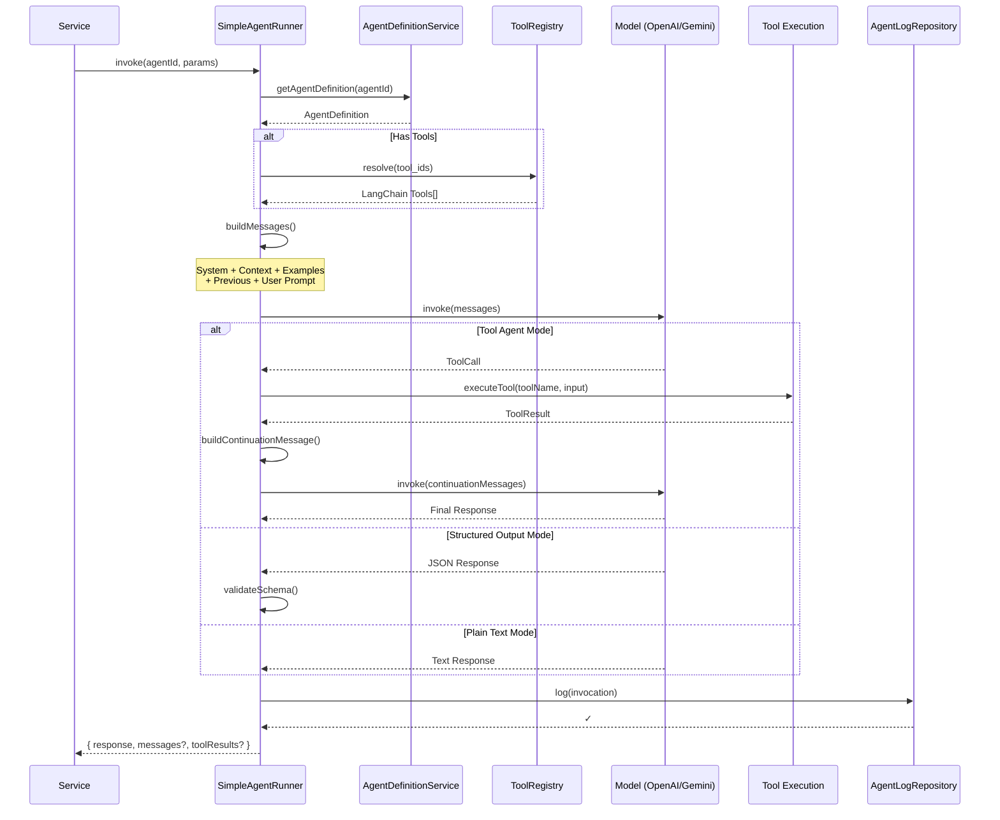

# Agent System Overview

The Agent System is the core of GymText's AI functionality. Agents are database-driven configurations that define how AI models (OpenAI, Google Gemini) interact with tools, context, and validation rules to accomplish specific tasks like generating fitness plans, creating workouts, or handling user conversations.

## How Agents Work

### Agent Definitions

Agents are defined in the `agent_definitions` table with **append-only versioning**. The latest `created_at` timestamp identifies the active version of an agent.

**Schema columns**:

| Column | Purpose |
|--------|---------|
| `agent_id` | Unique identifier (e.g., `'chat:generate'`, `'plan:generate'`) |
| `system_prompt` | System prompt defining agent behavior and constraints |
| `user_prompt_template` | Template with `{{variable}}` substitution for dynamic prompts |
| `model` | Model identifier (e.g., `'gpt-5.2'`, `'gemini-2.5-flash'`) |
| `tool_ids` | Array of tool names available to agent (e.g., `['get_user_profile', 'get_exercises']`) |
| `output_schema` | JSON Schema for structured output validation |
| `temperature` | Model temperature (controls randomness) |
| `max_tokens` | Maximum tokens in response |
| `max_iterations` | Max tool loop iterations |
| `examples` | Few-shot examples (user/assistant pairs) |
| `eval_rubric` | Evaluation criteria for output quality |

### Prompt Management

Prompts are the **single source of truth** and live in `/prompts/*.md` files:

- **System prompts**: `01-profile-agent.md`, `02-plan-agent.md`, `03-microcycle-agent.md`, `04-workout-message-agent.md`, `05-week-modify-agent.md`
- **User prompt templates**: Corresponding `-USER.md` files (e.g., `01-profile-agent-USER.md`)

The seed script (`pnpm seed --agents`) reads these markdown files and upserts them to the `agent_definitions` table at seed time.

**Important**: Never edit prompts directly in the database — always edit the `.md` files and re-seed.

### Agent ID Constants

All agent IDs are defined as constants in `packages/shared/src/server/agents/constants.ts`. This ensures type-safe references throughout the codebase.

Example:
```typescript
export const AGENT_IDS = {
  CHAT_GENERATE: 'chat:generate',
  PLAN_GENERATE: 'plan:generate',
  PROFILE_FITNESS: 'profile:fitness',
  // ... 13 more agents
} as const;
```

## SimpleAgentRunner Invocation Flow

The `SimpleAgentRunner` (`packages/shared/src/server/agents/runner/simpleAgentRunner.ts`) is the **single entry point** for all agent invocations. Services never instantiate LLMs directly — they always call `agentRunner.invoke()`.

### Basic Usage

```typescript
const result = await agentRunner.invoke('chat:generate', {
  input: message,
  params: { user: userWithProfile, previousMessages },
});
```

### 7-Step Invocation Flow

1. **Fetch Configuration**: Retrieve agent definition from `agent_definitions` table via `agentDefinitionService` (cached 5 minutes)

2. **Resolve Tools**: If `tool_ids` present in definition, query the ToolRegistry to resolve tool implementations and inject `ToolExecutionContext`

3. **Apply User Prompt Template**: Perform `{{variable}}` substitution using values from `params`

4. **Build Message Sequence**: Assemble messages in order:
   - System prompt
   - Context strings
   - Few-shot examples
   - Previous conversation messages
   - Current user prompt

5. **Execute**: Invoke the model in one of three modes:
   - **Tool agent mode** (if tools present): Iterative tool loop with continuation logic
   - **Structured output mode** (if `output_schema` present): JSON Schema validated response
   - **Plain text mode** (default): Simple text response

6. **Log Invocation**: Write execution details to `agent_logs` table (fire-and-forget)

7. **Return Result**: `{ response, messages?, toolResults? }`

### Sequence Diagram



## Invoke Parameters

```typescript
interface SimpleAgentInvokeParams {
  input?: string;                      // Primary user message or query
  params?: Record<string, unknown>;    // Extra data (user object, workout info, etc.)
  previousMessages?: Message[];        // Conversation history for context
  context?: string[];                  // Additional context strings
}
```

### Example Invocation

```typescript
const result = await agentRunner.invoke(AGENT_IDS.CHAT_GENERATE, {
  input: userMessage,
  params: {
    user: userWithProfile,
    previousMessages: conversationHistory,
    currentWorkout: todayWorkout,
  },
  context: ['User wants to modify leg day'],
});
```

## Message Building Order

Messages are assembled in this precise order (from `agents/utils.ts`):

1. **System Prompt** (role: `system`)
   - Defines agent behavior, constraints, and instructions

2. **Few-Shot Examples** (user/assistant pairs, section: `example`)
   - Examples from `examples` field in agent definition

3. **Context Strings** (role: `user`, section: `context`)
   - Additional context injected by caller

4. **Previous Messages** (section: `previous`)
   - Conversation history for continuity

5. **Current User Prompt** (role: `user`, section: `user`)
   - Final user message or templated prompt

Each message includes metadata (section, timestamp) for tracking and debugging.

## Tool Execution & Continuation Logic

When an agent has access to tools, it enters an iterative loop:

1. Model invokes a tool with parameters
2. Tool executes and returns result
3. Runner builds continuation message based on tool category:
   - **QUERY tools** (e.g., `get_workout`): "Introduce the answer naturally into your response"
   - **ACTION tools** (e.g., `modify_workout`): "Confirm what was done, then respond"
4. Runner re-invokes model with continuation message
5. Process repeats until model stops calling tools (max `max_iterations`)

The continuation logic ensures tool results are naturally integrated into the final response.

## Dependencies (SimpleAgentRunnerDeps)

The SimpleAgentRunner requires these dependencies:

```typescript
interface SimpleAgentRunnerDeps {
  agentDefinitionService: AgentDefinitionService;  // Fetch configs from DB
  toolRegistry: ToolRegistry;                       // Resolve tool implementations
  getServices: () => ToolServiceContainer;          // Lazy service access (breaks circular deps)
  agentLogRepository?: AgentLogRepository;          // Optional: log invocations
}
```

**Key pattern**: `getServices()` is a lambda function, not a service instance. This breaks circular dependencies between services and tools.

## Supported Models

The runner supports two model families:

### OpenAI
- `gpt-5-nano` (smallest, fastest)
- `gpt-5-mini`
- `gpt-5.1`
- `gpt-5.2` (most capable)
- `gpt-4o` (multimodal)

### Google
- `gemini-2.5-flash` (recommended for most tasks)
- `gemini-2.5-flash-lite` (faster, lighter)

Model initialization is handled in `agents/models.ts` with API key configuration.

## Prompt Management Workflow

### Authoring
- Edit prompts in `/prompts/*.md` files (markdown format)
- System prompts and user templates in separate files

### Seeding
```bash
pnpm seed --agents
```

This command:
1. Reads all `.md` files from `/prompts/`
2. Parses system prompt and user template
3. Upserts to `agent_definitions` table with current timestamp
4. Marks previous versions as inactive (newer `created_at` wins)

### Runtime
- `agentDefinitionService` fetches from DB (5-min cache)
- `SimpleAgentRunner` applies template variable substitution
- Messages built with resolved prompt content

### Important Notes
- Never edit `agent_definitions` table directly
- Always re-seed after prompt changes
- `.md` files are the single source of truth

## Key Files & Architecture

| File | Purpose |
|------|---------|
| `agents/runner/simpleAgentRunner.ts` | Main invocation engine — 7-step flow |
| `agents/runner/simpleTypes.ts` | TypeScript interfaces and types |
| `agents/constants.ts` | Agent ID constants (16 agents defined) |
| `agents/utils.ts` | Message building, continuation logic, prompt templates |
| `agents/models.ts` | Model initialization (OpenAI + Gemini clients) |
| `agents/types.ts` | Core types (Message, ToolResult, AgentDefinition, etc.) |
| `agents/tools/toolRegistry.ts` | Tool resolution at runtime |
| `agents/context/contextRegistry.ts` | Context provider resolution |
| `scripts/seed/system/agents.ts` | Seed script for agent definitions |
| `/prompts/*.md` | Prompt source files (system + user templates) |
| `agent_definitions` table | Persistent agent configurations (append-only versioning) |
| `agent_logs` table | Execution history and observability |

## Service Integration Pattern

Services delegate all LLM tasks to agents:

```typescript
// ✓ CORRECT: Use agentRunner
const response = await agentRunner.invoke(AGENT_IDS.CHAT_GENERATE, {
  input: userMessage,
  params: { user, previousMessages },
});

// ✗ WRONG: Never instantiate LLM directly
const llm = new ChatOpenAI(...);  // Don't do this!
```

This pattern ensures:
- All agent invocations are logged
- Configuration is centralized in the database
- Tools have consistent context access
- Model switching is configuration-only (no code changes)

## Observability

All agent invocations are logged to the `agent_logs` table with:
- Agent ID and version
- Input parameters
- Output and tool calls
- Execution time
- Error details (if any)
- User context

Logs enable debugging, performance monitoring, and quality evaluation.

## Configuration as Code

Agent definitions live in the database, but configurations are authored in code:

```typescript
// Agent ID constant
export const CHAT_GENERATE = 'chat:generate';

// Used in service
const result = await agentRunner.invoke(CHAT_GENERATE, { input, params });

// Database definition (from seed script)
// agent_id: 'chat:generate'
// system_prompt: '...'
// tool_ids: ['get_workout', 'modify_workout', 'update_profile']
// output_schema: {...}
// ...
```

This approach combines:
- **Code**: Type-safe constants and invocations
- **Database**: Centralized, versionable configurations
- **Markdown**: Human-readable prompt sources

## Summary

The Agent System provides a clean, scalable architecture for AI agents:

1. **Definitions**: Stored in database with append-only versioning
2. **Prompts**: Authored in markdown, seeded to database
3. **Execution**: `SimpleAgentRunner.invoke()` is the single entry point
4. **Tools**: Resolved at runtime via ToolRegistry
5. **Logging**: All invocations tracked for observability
6. **Models**: Configurable, support OpenAI and Google

Services call agents, agents execute tools, all configuration is database-driven with markdown as the source of truth.
