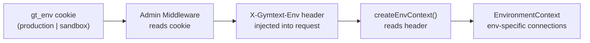

# Environment Context

## Overview

The admin app supports switching between production and sandbox environments (like Stripe's dashboard). The web app always uses production.

## Flow



1. User toggles environment in admin UI → sets `gt_env` cookie
2. Admin middleware reads cookie, sets `X-Gymtext-Env` header on API requests
3. `createEnvContext()` reads header, creates context with appropriate credentials
4. Services receive context with environment-specific db/twilio/stripe clients

## What Switches

| Service | Affected | Sandbox Variables |
|---------|----------|-------------------|
| Database | Yes | `SANDBOX_DATABASE_URL` |
| Twilio | Yes | `SANDBOX_TWILIO_ACCOUNT_SID`, `SANDBOX_TWILIO_AUTH_TOKEN`, `SANDBOX_TWILIO_NUMBER` |
| Stripe | Yes | `SANDBOX_STRIPE_SECRET_KEY`, `SANDBOX_STRIPE_WEBHOOK_SECRET` |
| OpenAI | No | Always uses production |
| Google AI | No | Always uses production |
| Pinecone | No | Always uses production |

If sandbox variables are not set, sandbox mode falls back to production credentials.

## Usage

### Admin App (supports environment switching)
```typescript
import { createEnvContext } from '@gymtext/shared/server';

export async function GET() {
  const ctx = await createEnvContext();  // Respects X-Gymtext-Env header
  const users = await ctx.db.selectFrom('users').selectAll().execute();
  return Response.json(users);
}
```

### Web App (always production)
```typescript
import { createProductionContext } from '@gymtext/shared/server';

export async function GET() {
  const ctx = await createProductionContext();  // Always production
  // ...
}
```

## EnvironmentContext Object

```typescript
interface EnvironmentContext {
  mode: string;                    // 'production' | 'sandbox'
  secrets: EnvironmentSecrets;     // All credential objects
  db: Kysely<DB>;                  // Database connection
  twilioClient: ITwilioClient;     // Twilio client
  stripeClient: Stripe;            // Stripe client
}
```

## Caching

Contexts are cached by database URL in a `contextCache` Map. Same credentials = same context instance. Use `clearContextCache()` for testing.

## Key Files

| File | Purpose |
|------|---------|
| `packages/shared/src/server/context/createEnvContext.ts` | Factory for environment contexts |
| `apps/admin/src/middleware.ts` | Injects X-Gymtext-Env header |
| `apps/admin/src/context/EnvironmentContext.tsx` | React context for UI toggle |
| `packages/shared/src/server/connections/*/factory.ts` | Connection factories with caching |
