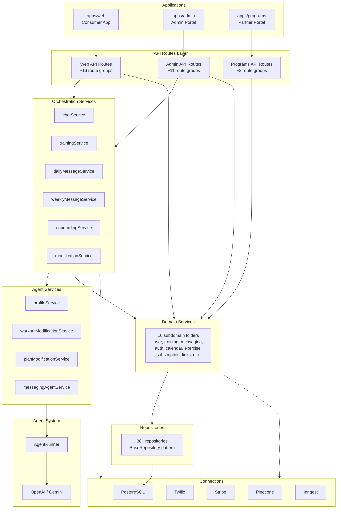

# Architecture Overview

## System Overview
GymText is a monorepo with 3 Next.js apps and a shared package:
- **apps/web** — Consumer app (gymtext.com): chat, onboarding, workouts, blog
- **apps/admin** — Admin portal (admin.gymtext.com): user management, agent config, exercises
- **apps/programs** — Partner portal (localhost:3002): program creation, blog, enrollment management
- **packages/shared** — `@gymtext/shared` package: all server logic (services, repositories, agents, connections)

Tech stack: Next.js 16, React 19, TypeScript, PostgreSQL + Kysely, LangChain (OpenAI + Gemini), Twilio, Stripe, Pinecone, Inngest.

## Layer Diagram

## Architectural Rules

1. **Only domain services call repositories** — orchestration services delegate through domain services
2. **Only AgentRunner invokes LLMs** — services call `agentRunner.invoke()`, never instantiate models directly
3. **Repositories never call services** — data access is a leaf layer with no upward dependencies
4. **Services are stateless factories** — created per-request via `createServices()`, no persistent state
5. **Orchestration coordinates but doesn't skip layers** — calls domain services, never repositories directly

## Request Lifecycle Example

SMS message flow:
1. User sends SMS → Twilio webhook
2. `POST /api/twilio/sms` route receives request
3. Route creates `EnvironmentContext` → `ServiceContainer`
4. Route calls `chatService.handleMessage(user, message)`
5. ChatService calls `agentRunner.invoke('chat:generate', ...)` with tools
6. AgentRunner builds messages, invokes LLM
7. LLM may call tools (e.g., `get_workout` → `trainingService.getOrGenerateWorkout()`)
8. Tool results fed back to LLM for natural language response
9. Response queued via `messagingOrchestrator` → Twilio → SMS to user

## Section Index

- [Layer Separation](./layers.md) — Detailed breakdown of each architectural layer
- [Service Factory](./service-factory.md) — 5-phase bootstrap process
- [Environment Context](./environment-context.md) — Cookie-based environment switching
- [App Structure](./apps.md) — Web app, admin app, programs portal, shared package
- [Utilities](./utilities.md) — Date, timezone, circuit breaker, formatters
- [Libraries](./libraries.md) — Key dependencies and versions
