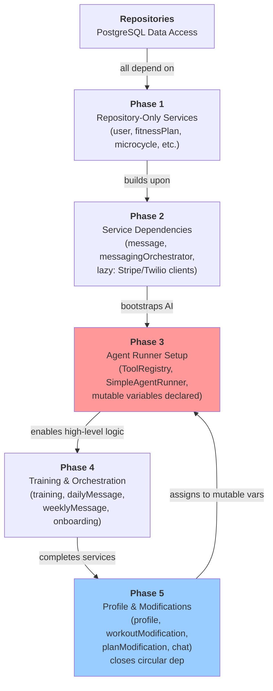

# Service Factory & Bootstrap

## Overview

The `createServices()` function in `packages/shared/src/server/services/factory.ts` bootstraps all services in 5 phases, carefully ordering dependencies to avoid circular references. This pattern allows the system to create an interconnected graph of ~45 services while managing complex dependencies, particularly the circular dependency between services, tools, and the AgentRunner.

## 5-Phase Bootstrap

### Phase 1: Repository-Only Services

Services that depend only on the repository container. Created first — no internal service dependencies.

**Created services:**
- `user` — User account operations
- `onboardingData` — Onboarding session state
- `fitnessPlan` — Fitness plan CRUD operations
- `microcycle` — Weekly training patterns
- `progress` — Workout progress tracking
- `subscription` — Stripe subscription data
- `dayConfig` — Daily configuration settings
- `shortLink` — URL shortening
- `queue` — Message queueing
- `agentDefinition` — Agent configuration lookup
- `agentLog` — Agent invocation logging
- `markdown` — Markdown template processing
- `fitnessProfile` — Fitness profile data (with lazy agentRunner getter)
- `programOwner` — Program ownership
- `program` — Program definitions
- `enrollment` — User program enrollment
- `programVersion` — Program versioning
- `exerciseResolution` — Exercise lookup
- `exerciseMetrics` — Exercise performance tracking
- `blog` — Blog content
- `organization` — Organization data
- `workoutInstance` — Individual workout instances

**Dependency graph:** All depend only on `RepositoryContainer` (database access).

### Phase 2: Services with Service Dependencies

Services that depend on other Phase 1 services, plus lazy-initialized external-client services.

**Created services:**

- **`message`** — Handles user messages
  - Depends on: `user`

- **`referral`** — Referral program logic
  - Lazy: Requires Stripe client (created on first access)

- **`adminAuth`** — Admin SMS verification
  - Lazy: Requires Twilio client (created on first access)

- **`userAuth`** — User SMS verification
  - Lazy: Requires Twilio client + `adminAuth`

- **`programOwnerAuth`** — Program owner SMS verification
  - Lazy: Requires Twilio client

- **`messagingOrchestrator`** — Coordinates messaging operations
  - Lazy: Requires `message`, `queue`, `user`, `subscription` + Twilio client

**Dependency graph:** Services depend on Phase 1 services and external clients via lazy getters.

### Phase 3: Agent Runner Setup

Creates the AI infrastructure that bridges services and tools.

**Steps:**

1. **Create ToolRegistry instance** — Registry for mapping tool names to implementations

2. **Register all tools** — Call `registerAllTools(registry)` to register all 5 tool implementations:
   - `update_profile` — Updates user fitness profile
   - `get_workout` — Fetches or generates today's workout
   - `make_modification` — Routes modification requests to appropriate sub-agents
   - `modify_workout` — Modifies workouts and weekly schedules within a week dossier
   - `modify_plan` — Modifies entire fitness plans

3. **Declare mutable variables** — Reserve slots for Phase 5 services:
   ```typescript
   let profile: ProfileService;
   let workoutModification: WorkoutModificationService;
   let planModification: PlanModificationService;
   ```

4. **Build `buildToolServices()` lambda** — Captures mutable variables and provides `ToolServiceContainer` to tools at runtime:
   ```typescript
   const buildToolServices = () => ({
     profile,
     workoutModification,
     planModification,
     training,
     queueMessage
   });
   ```
   **Critical:** This lambda reads the Phase 5 variables at runtime (when tools execute), not at definition time.

5. **Create SimpleAgentRunner** — AI orchestration engine:
   ```typescript
   const agentRunner = new SimpleAgentRunner({
     agentDefinitionService,
     toolRegistry,
     getServices: buildToolServices,
     agentLogRepository,
     // model config, retry settings, etc.
   });
   ```

**Result:** A fully functional AgentRunner ready to invoke agents, which will call tools that access services via the lambda.

### Phase 4: Training & Orchestration Services

Services that depend on agentRunner and Phase 1-2 services. These handle the complex business logic for workout generation, messaging, and user coaching.

**Created services:**

- **`training`** — Core training logic
  - Depends on: `user`, `markdown`, `agentRunner`, `workoutInstance`, `shortLink`

- **`programAgent`** — Program-related AI operations
  - Depends on: `agentRunner`

- **`messagingAgent`** — Messaging-related AI operations
  - Depends on: `agentRunner`

- **`dailyMessage`** — Daily coaching messages
  - Depends on: `user`, `messagingOrchestrator`, `dayConfig`, `training`

- **`weeklyMessage`** — Weekly coaching messages
  - Depends on: `user`, `messagingOrchestrator`, `training`, `markdown`, `messagingAgent`, `dayConfig`

- **`onboarding`** — Onboarding flow orchestration
  - Depends on: `markdown`, `training`, `messagingOrchestrator`, `messagingAgent`

- **`onboardingCoordinator`** — Onboarding coordination
  - Depends on: `onboardingData`, `user`, `onboarding`, `subscription`

**Dependency graph:** All depend on AgentRunner and other Phase 1-4 services.

### Phase 5: Profile, Modification & Chat Services

Final services that close the circular dependency loop. These are the "high-level" services that depend on everything else, including the AgentRunner.

**Created services:**

- **`workoutModification`** — Workout modification logic
  - Depends on: `user`, `markdown`, `training`, `agentRunner`, `messagingOrchestrator`
  - Assigned to mutable variable in Phase 3

- **`profile`** — User fitness profile operations
  - Depends on: `user`, `markdown`, `agentRunner`
  - Assigned to mutable variable in Phase 3

- **`planModification`** — Fitness plan modification logic
  - Depends on: `user`, `markdown`, `workoutModification`, `agentRunner`
  - Assigned to mutable variable in Phase 3

- **`modification`** — Modification routing
  - Depends on: `user`, `workoutModification`, `planModification`

- **`chat`** — Main chat service (SMS responses)
  - Depends on: `message`, `user`, `markdown`, `agentRunner`

**Circular Dependency Resolution:**

The key to breaking the circular dependency (Tools → Services → AgentRunner → Tools) is timing:

1. Phase 3 declares mutable variable references (Phase 5 services don't exist yet)
2. Phase 3 creates `buildToolServices()` lambda that reads these variables
3. Phase 3 creates AgentRunner with the lambda as `getServices()`
4. Phase 5 creates the actual service instances and assigns them to the mutable variables
5. **Runtime:** When tools execute, they call `getServices()`, which now returns fully-initialized services

```typescript
// Phase 3: Services don't exist yet, just reserve slots
let profile: ProfileService;
let workoutModification: WorkoutModificationService;
let planModification: PlanModificationService;

const buildToolServices = () => ({
  profile,              // Reads current value (undefined now, assigned later)
  workoutModification,
  planModification,
  training,
  queueMessage
});

const agentRunner = new SimpleAgentRunner({
  getServices: buildToolServices,  // Pass the lambda, not the values
  // ...
});

// Phase 5: Now assign the actual instances
profile = new ProfileService(/* ... */);
workoutModification = new WorkoutModificationService(/* ... */);
planModification = new PlanModificationService(/* ... */);
```

## Lazy External Clients

Stripe, Twilio, and other external clients are created on-demand, not at bootstrap:

- **When:** Clients created on first access to the lazy getter
- **Why:** Reduces bootstrap time, avoids unnecessary connections if services aren't used
- **How:** Services that need external clients receive lazy getter functions

Example:
```typescript
// In Phase 2 service
referralService = new ReferralService(
  repositories,
  async () => getStripeClient()  // Lazy getter
);
```

The Stripe client is only created when `referralService` first calls `getStripeClient()`.

## ServiceContainer Return

The `createServices()` function returns a `ServiceContainer` with all ~45 services accessible as properties:

```typescript
const services = await createServices(ctx);

// Access services
const user = await services.user.findById(userId);
const chat = await services.chat.handleMessage(message);
const training = await services.training.generateWorkout(params);
```

Services that depend on external clients use lazy getters internally — the ServiceContainer interface is clean and synchronous.

## Phase Dependencies Flowchart



The arrow from P5 back to P3 shows the circular dependency resolution: Phase 5 services are assigned to the mutable variables declared in Phase 3, which are read by the lambda passed to AgentRunner.

## Key Files

- **Main factory:** `packages/shared/src/server/services/factory.ts`
- **Tool registry:** `packages/shared/src/server/agents/tools/toolRegistry.ts`
- **Agent runner:** `packages/shared/src/server/agents/runner/agentRunner.ts`
- **Tool definitions:** `packages/shared/src/server/agents/tools/definitions/*.ts`
- **Service definitions:** `packages/shared/src/server/services/*.ts`

## Best Practices

1. **Always use `createServices()`** — Never manually instantiate services to ensure correct ordering
2. **New services:** Add to the appropriate phase based on dependencies
3. **New tools:** Register in Phase 3 via `registerAllTools()`
4. **External clients:** Use lazy getters if not always needed
5. **Circular dependencies:** If you encounter them, add a Phase 3 mutable variable and lambda capture pattern

## Common Patterns

### Adding a Service that Uses AgentRunner

```typescript
// In Phase 4 or 5, depending on what else depends on it
const myService = new MyService(
  repos.myRepo,
  phase2Services.someService,
  agentRunner  // Pass agentRunner
);
```

### Adding a Service that Other Services Depend On

```typescript
// In appropriate phase based on dependencies
const newService = new NewService(
  repos.repo1,
  repos.repo2,
  phaseXServices.dependency1
);

// Then reference it in later phases:
// services.push(newService);
```

### Adding a Tool

1. Implement tool in `packages/shared/src/server/agents/tools/definitions/`
2. Add to `registerAllTools()` in Phase 3
3. Reference in agent definition by tool ID
4. Access services via `getServices()` lambda in tool execution
