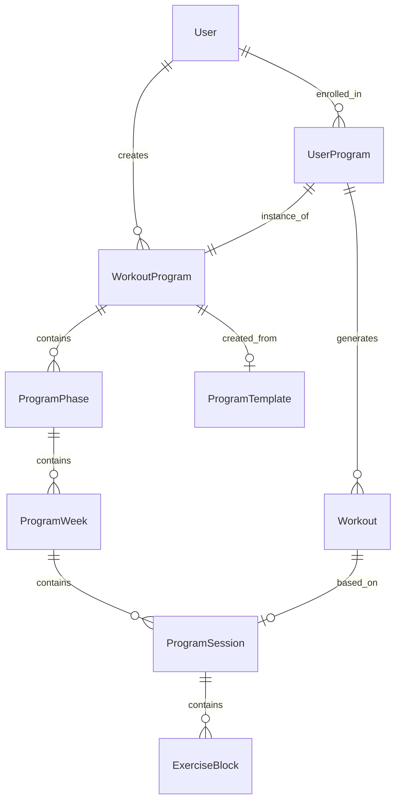

# Data Models: Workout Planning System

## Overview

This document details the data models and storage formats for the enhanced workout planning system. The design prioritizes flexibility, queryability, and integration with both AI agents and future UI components.

## Core Data Models

### 1. Workout Program

The central entity representing a complete training program.

```typescript
interface WorkoutProgram {
  id: string;
  userId: string;
  name: string;
  description?: string;
  programType: 'strength' | 'hypertrophy' | 'endurance' | 'hybrid' | 'custom';
  durationType: 'fixed' | 'ongoing';
  durationWeeks?: number; // null for ongoing programs
  startDate: Date;
  endDate?: Date; // calculated for fixed programs
  status: 'draft' | 'active' | 'paused' | 'completed' | 'archived';
  goals: ProgramGoals;
  equipmentRequired: Equipment[];
  metadata: ProgramMetadata;
  createdAt: Date;
  updatedAt: Date;
}

interface ProgramGoals {
  primary: Goal;
  secondary: Goal[];
  metrics: MetricTarget[];
  timeline?: string; // "12 weeks", "ongoing until goal met"
}

interface Goal {
  type: 'strength' | 'muscle_gain' | 'fat_loss' | 'endurance' | 'sport_specific' | 'general_fitness';
  description: string;
  priority: 'high' | 'medium' | 'low';
}

interface MetricTarget {
  name: string; // "bench_press_1rm", "body_weight", "5k_time"
  current: number;
  target: number;
  unit: string; // "lbs", "kg", "minutes"
}

interface ProgramMetadata {
  experienceLevel: 'beginner' | 'intermediate' | 'advanced';
  sessionsPerWeek: number;
  averageSessionDuration: number; // minutes
  primaryMuscleGroups: string[];
  trainingPhilosophy?: string; // "conjugate", "linear", "DUP"
  specialConsiderations?: string[]; // injuries, preferences
}
```

### 2. Program Phase

Represents distinct training phases within a program (e.g., hypertrophy phase, strength phase).

```typescript
interface ProgramPhase {
  id: string;
  programId: string;
  phaseNumber: number;
  name: string; // "Foundation", "Strength Building", "Peaking"
  description?: string;
  focus: PhaseFocus;
  startWeek: number;
  endWeek: number;
  trainingVariables: TrainingVariables;
  progressionStrategy: ProgressionStrategy;
  createdAt: Date;
}

type PhaseFocus = 'anatomical_adaptation' | 'hypertrophy' | 'strength' | 
                  'power' | 'peaking' | 'deload' | 'maintenance';

interface TrainingVariables {
  intensityRange: {
    min: number; // percentage of 1RM
    max: number;
  };
  volumeTargets: {
    setsPerMuscleGroup: Record<string, number>; // per week
    totalSets: number; // per week
  };
  repRanges: Record<string, [number, number]>; // exercise type -> [min, max]
  restPeriods: Record<string, number>; // exercise type -> seconds
  tempoGuidelines?: Record<string, string>; // exercise type -> "3-1-1-0"
}

interface ProgressionStrategy {
  type: 'linear' | 'undulating' | 'block' | 'autoregulated';
  weeklyIncrement?: number; // percentage increase
  deloadFrequency?: number; // every N weeks
  intensificationRate?: number; // how quickly to increase intensity
}
```

### 3. Program Week

Weekly structure within a phase.

```typescript
interface ProgramWeek {
  id: string;
  programId: string;
  phaseId: string;
  weekNumber: number;
  name?: string; // "High Volume Week", "Deload Week"
  description?: string;
  weeklyVolumeTarget: WeeklyVolume;
  trainingSplit: TrainingSplit;
  specialInstructions?: string[];
  createdAt: Date;
}

interface WeeklyVolume {
  totalSets: number;
  setsPerMuscleGroup: Record<string, number>;
  primaryLifts: Record<string, number>; // lift name -> weekly volume
  intensityDistribution: IntensityDistribution;
}

interface IntensityDistribution {
  light: number; // percentage of sets < 70% 1RM
  moderate: number; // 70-85% 1RM
  heavy: number; // > 85% 1RM
}

interface TrainingSplit {
  type: 'upper_lower' | 'push_pull_legs' | 'full_body' | 
        'body_part' | 'movement_pattern' | 'custom';
  schedule: DayAssignment[];
}

interface DayAssignment {
  dayOfWeek: number; // 0-6
  sessionType: string; // "upper_power", "lower_hypertrophy"
  primaryFocus: string[];
  isOptional: boolean;
}
```

### 4. Program Session

Individual workout session templates.

```typescript
interface ProgramSession {
  id: string;
  weekId: string;
  dayOfWeek: number; // 0-6 (Sunday-Saturday)
  sessionType: SessionType;
  name: string; // "Upper Body Power"
  description?: string;
  durationMinutes: number;
  warmupProtocol?: WarmupProtocol;
  exercises: ExerciseBlock[];
  cooldownProtocol?: CooldownProtocol;
  coachingNotes?: string;
  createdAt: Date;
}

type SessionType = 'strength' | 'hypertrophy' | 'power' | 'conditioning' | 
                   'mobility' | 'recovery' | 'hybrid';

interface WarmupProtocol {
  general: string[]; // ["5 min bike", "dynamic stretching"]
  specific: string[]; // ["band pull-aparts", "empty bar sets"]
  duration: number; // minutes
}

interface ExerciseBlock {
  blockType: 'main' | 'accessory' | 'conditioning' | 'core' | 'mobility';
  blockLabel?: string; // "A1", "B1", etc. for supersets
  exercises: Exercise[];
  restBetweenSets?: number; // seconds
  specialInstructions?: string;
}

interface Exercise {
  id: string;
  name: string;
  category: ExerciseCategory;
  sets: SetScheme[];
  techniqueNotes?: string[];
  alternatives?: string[]; // exercise names that can substitute
  videoUrl?: string;
  equipmentNeeded: string[];
}

type ExerciseCategory = 'compound' | 'isolation' | 'olympic' | 'plyometric' | 
                       'cardio' | 'mobility' | 'core';

interface SetScheme {
  setNumber: number;
  reps: string; // "8-10", "5", "AMRAP", "30 seconds"
  intensity?: string; // "70%", "RPE 8", "bodyweight"
  rest?: number; // seconds after this set
  notes?: string; // "pause at bottom", "slow eccentric"
}

interface CooldownProtocol {
  activities: string[];
  duration: number;
  focus: 'flexibility' | 'recovery' | 'mindfulness';
}
```

### 5. User Program Instance

User-specific program assignment with adaptations.

```typescript
interface UserProgram {
  id: string;
  userId: string;
  programId: string;
  startedAt: Date;
  currentWeek: number;
  currentPhaseId: string;
  adaptations: ProgramAdaptations;
  status: 'active' | 'paused' | 'completed' | 'abandoned';
  progress: ProgramProgress;
  completedAt?: Date;
  createdAt: Date;
  updatedAt: Date;
}

interface ProgramAdaptations {
  equipmentSubstitutions: Record<string, string>; // original -> substitute
  scheduleModifications: ScheduleModification[];
  injuryAccommodations: InjuryAccommodation[];
  preferenceOverrides: Record<string, any>;
  currentMode?: 'normal' | 'travel' | 'time_constrained' | 'recovery';
}

interface ScheduleModification {
  originalDay: number;
  newDay: number;
  reason: string;
  effectiveFrom: Date;
  effectiveUntil?: Date;
}

interface InjuryAccommodation {
  bodyPart: string;
  severity: 'minor' | 'moderate' | 'severe';
  restrictedMovements: string[];
  modificationStrategy: 'substitute' | 'reduce_load' | 'avoid';
  effectiveFrom: Date;
  reviewDate: Date;
}

interface ProgramProgress {
  completedWeeks: number;
  completedWorkouts: number;
  adherenceRate: number; // percentage
  strengthProgress: Record<string, number>; // exercise -> percentage increase
  volumeProgress: Record<string, number>; // muscle group -> total volume
  goalProgress: MetricTarget[];
  milestones: Milestone[];
}

interface Milestone {
  name: string;
  achievedAt: Date;
  value: any;
  celebration?: string; // special message or reward
}
```

### 6. Enhanced Workout Model

Updates to the existing workout model to integrate with programs.

```typescript
interface Workout {
  // Existing fields...
  id: string;
  userId: string;
  date: Date;
  workoutType: string;
  exercises: any; // existing JSON structure
  sentAt?: Date;
  
  // New fields for program integration
  programSessionId?: string; // links to program template
  userProgramId?: string; // links to user's program instance
  actualExercises?: ActualExercise[]; // structured performance data
  modifications?: WorkoutModification[];
  completionData?: CompletionData;
  feedbackReceived?: boolean;
}

interface ActualExercise {
  exerciseName: string;
  plannedSets: SetScheme[];
  performedSets: PerformedSet[];
  notes?: string;
  rpe?: number; // rate of perceived exertion
  formQuality?: number; // 1-10
}

interface PerformedSet {
  setNumber: number;
  reps: number;
  weight?: number;
  duration?: number; // for time-based exercises
  rest?: number;
  difficulty: 'easy' | 'moderate' | 'hard' | 'failure';
}

interface WorkoutModification {
  originalExercise: string;
  modifiedTo: string;
  reason: string;
  approvedBy: 'user' | 'system' | 'ai';
}

interface CompletionData {
  completedAt: Date;
  duration: number; // minutes
  overallDifficulty: number; // 1-10
  energyLevel: 'low' | 'moderate' | 'high';
  soreness: Record<string, number>; // body part -> 1-10
  generalNotes?: string;
}
```

## JSON Storage Schemas

### Program Template Format

For storing reusable program templates:

```json
{
  "template": {
    "name": "12-Week Powerlifting Prep",
    "description": "Competition preparation program",
    "metadata": {
      "author": "System",
      "version": "1.0",
      "lastUpdated": "2024-01-20",
      "tags": ["powerlifting", "competition", "strength"]
    },
    "requirements": {
      "experienceLevel": "intermediate",
      "equipment": ["barbell", "rack", "bench", "plates"],
      "daysPerWeek": 4,
      "assessments": ["1RM squat", "1RM bench", "1RM deadlift"]
    },
    "structure": {
      "phases": [
        {
          "name": "Volume Accumulation",
          "weeks": 4,
          "focus": "hypertrophy",
          "keyMetrics": ["total volume", "technique"]
        }
      ],
      "weeklyTemplates": {
        "standard": {
          "monday": "squat_bench",
          "wednesday": "deadlift_accessories",
          "friday": "bench_squat",
          "saturday": "conditioning_core"
        }
      }
    }
  }
}
```

### Exercise Database Entry

```json
{
  "exercise": {
    "id": "bench-press",
    "name": "Barbell Bench Press",
    "aliases": ["bench", "flat bench"],
    "category": "compound",
    "primaryMuscles": ["chest", "triceps", "front_delts"],
    "equipment": ["barbell", "bench", "rack"],
    "difficulty": "intermediate",
    "instructions": [
      "Lie on bench with eyes under bar",
      "Grip bar slightly wider than shoulders",
      "Lower bar to chest with control",
      "Press bar up to starting position"
    ],
    "commonErrors": [
      "Bouncing off chest",
      "Flaring elbows too wide",
      "Losing shoulder position"
    ],
    "progressions": {
      "beginner": "dumbbell_bench_press",
      "advanced": "pause_bench_press"
    },
    "videoUrl": "https://example.com/bench-press"
  }
}
```

## Data Relationships



## Indexing Strategy

### Primary Indexes
- `workout_programs`: (user_id, status)
- `program_phases`: (program_id, phase_number)
- `program_weeks`: (phase_id, week_number)
- `program_sessions`: (week_id, day_of_week)
- `user_programs`: (user_id, status), (program_id)
- `workouts`: (user_id, date), (user_program_id)

### Search Indexes
- Full-text search on program names and descriptions
- JSONB indexes for equipment and exercise searches
- Composite indexes for progress tracking queries

## Migration Considerations

### From Current System
1. Create program records for existing users
2. Link historical workouts to generated program sessions
3. Migrate vector-stored outlines to structured programs
4. Preserve all existing workout data

### Data Integrity
- Foreign key constraints with appropriate CASCADE rules
- Check constraints for valid enum values
- Triggers for updated_at timestamps
- Validation at application layer

## Performance Optimizations

### Caching Strategy
- Cache active program structures in Redis
- Store frequently accessed exercise data
- Pre-compute weekly summaries
- Invalidate on program modifications

### Query Optimization
- Minimize N+1 queries with eager loading
- Use database views for complex aggregations
- Implement pagination for workout history
- Batch operations for bulk updates

## Future Extensibility

The schema is designed to support:
- Multi-user programs (group training)
- Nutrition integration (meal plans linked to training phases)
- Competition/event preparation (peak and taper)
- Social features (program sharing, leaderboards)
- Advanced analytics (ML-based adaptations)